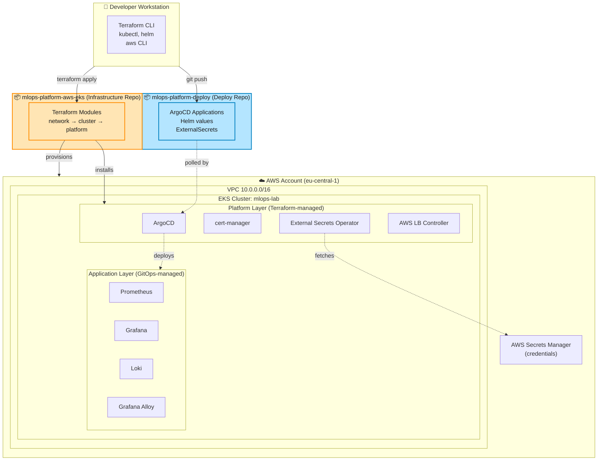
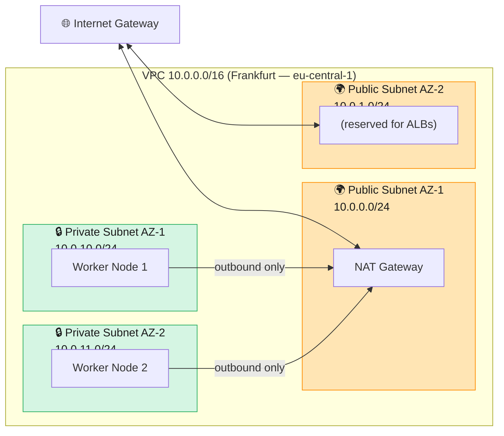
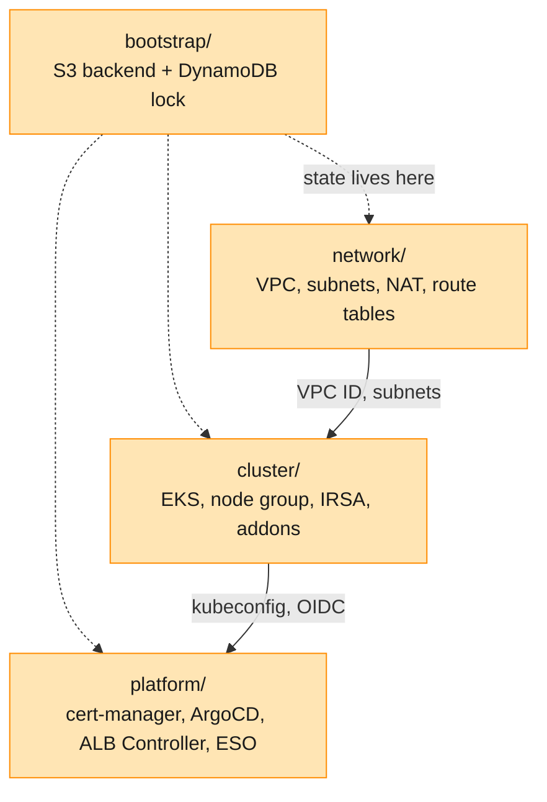
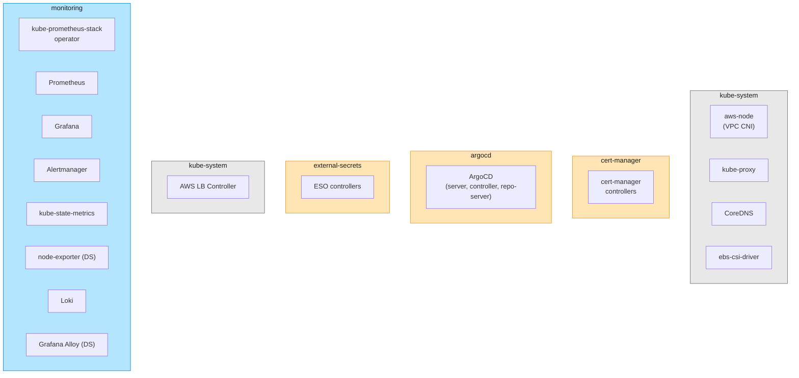
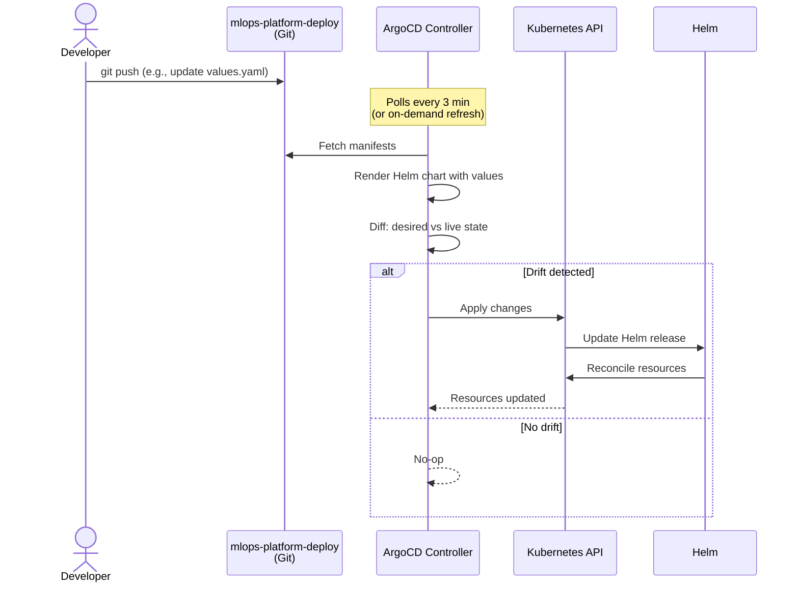
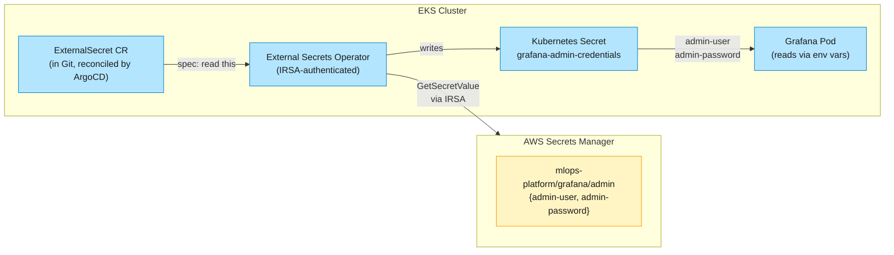
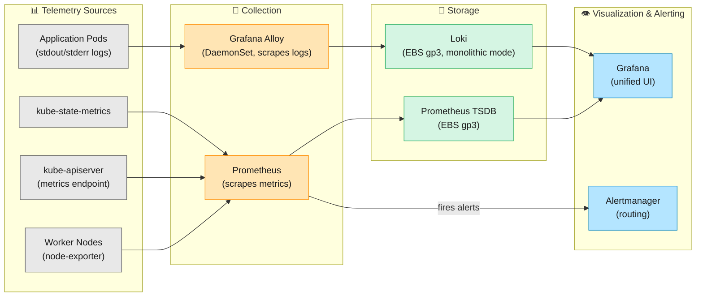
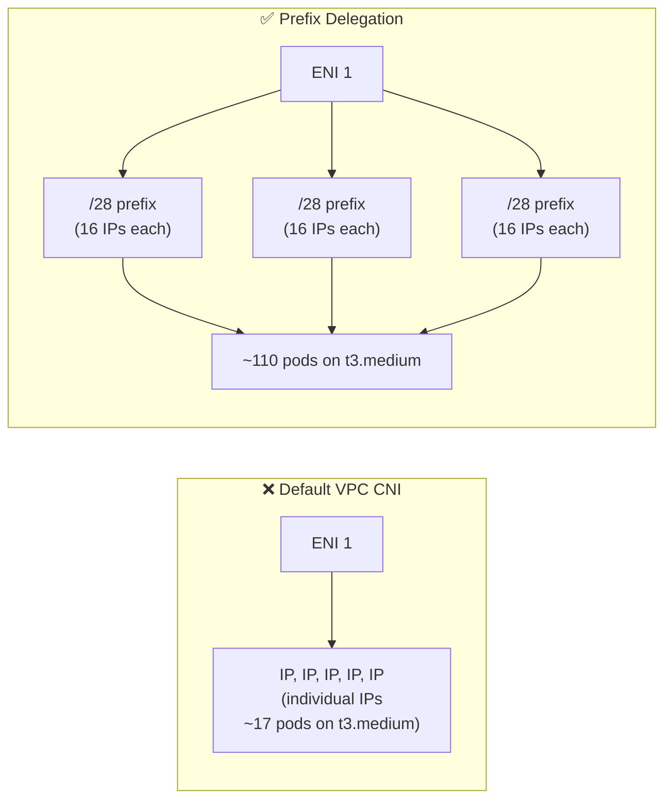

# Architecture

This document describes the architecture of the MLOps platform — the high-level shape of the system, how the layers fit together, and which architectural decisions shaped what you see.

For the rationale behind specific decisions, see [`docs/adr/`](./adr/). For the issues encountered and how they were resolved, see [`docs/lessons-learned.md`](./lessons-learned.md).

## What this is

A production-grade MLOps platform on AWS EKS, designed to demonstrate end-to-end ownership of:

- **Infrastructure as code** — every AWS resource defined in Terraform, modularized by lifecycle (network → cluster → platform)
- **GitOps application delivery** — workloads deployed via ArgoCD watching a separate deploy repo
- **Unified observability** — metrics, logs, and dashboards through Prometheus, Loki, Alloy, and Grafana
- **Secrets management** — credentials sourced from AWS Secrets Manager via External Secrets Operator, no plaintext in Git
- **Operational discipline** — daily destroy/apply rhythm, automated bootstrap, ADR-tracked decisions

Two repositories collaborate to deliver this:

| Repo | Owns | Examples |
|------|------|----------|
| `mlops-platform-aws-eks` (this one) | **Infrastructure** — VPC, EKS, IAM, platform services | Terraform modules, ArgoCD installation, ADRs |
| `mlops-platform-deploy` | **Applications** — what runs on the platform | ArgoCD `Application` manifests, Helm values |

## High-level system view

The key separation: **Terraform owns infrastructure, ArgoCD owns applications.** Each tool does what it's designed for, and they meet at exactly one boundary — the ArgoCD root Application, which lives in Terraform but bootstraps the GitOps loop. See [ADR 0004 (Terraform/ArgoCD boundary)](./adr/0004-terraform-argocd-boundary.md) for the reasoning.

## Network topology

Standard two-AZ pattern with public/private subnet split. NAT Gateway in AZ-1 provides outbound internet for both private subnets. Worker nodes have no public IPs — only the EKS control plane (AWS-managed) and the eventual ALBs (in public subnets) are internet-facing.

**Architectural notes:**
- Single NAT Gateway is a deliberate cost optimization for a lab. Production multi-AZ resilience would deploy one NAT Gateway per AZ — at the cost of running two NAT Gateways simultaneously (~€60/month total).
- The original design used a NAT instance instead of NAT Gateway. That choice failed during EKS bootstrap; see [Issue 1 in lessons-learned](./lessons-learned.md#issue-1--nat-instance-failed--nodes-could-not-join-eks-cluster) for the postmortem and the architectural lesson.

See [ADR 0002 (NAT strategy)](./adr/0002-nat-strategy.md) for the full reasoning chain.

## Terraform module structure

Modules are separated by **lifecycle**, not by component. The principle: things that get created/destroyed together belong together; things with different lifecycles live in different modules.

| Module | Lifecycle | Notes |
|--------|-----------|-------|
| `bootstrap` | One-time, never destroyed | Holds remote state for everything else |
| `network` | Long-lived, rarely changes | VPC + subnets + NAT |
| `cluster` | Daily destroy/apply (cost optimization) | EKS control plane + node group |
| `platform` | Daily destroy/apply (depends on cluster) | Helm releases for platform components |

The `cluster` and `platform` modules together cost ~€20/month with destroy/apply discipline (~6 hours/day) vs ~€100/month if running 24/7. The Taskfile's `mlops-up` and `mlops-down` aliases automate the daily ritual.

## Cluster anatomy

**Three layers, by ownership:**

1. **Kubernetes system** (gray) — managed by EKS or its managed addons. CoreDNS, kube-proxy, VPC CNI, EBS CSI driver. We don't manage these directly; AWS keeps them current.

2. **Platform layer** (orange) — installed via Terraform Helm releases. cert-manager, ArgoCD, External Secrets Operator, AWS Load Balancer Controller. These are foundational services that other workloads depend on. Installed once, updated rarely.

3. **Application layer** (blue) — managed via GitOps. The kube-prometheus-stack umbrella, Loki, Alloy. Anything running here is fully reconciled from the deploy repo. Changing a Helm value in the deploy repo and pushing causes ArgoCD to update the cluster within ~3 minutes.

## GitOps loop

Three minutes is a soft bound — most syncs complete in under a minute. The reconciliation is **continuous and idempotent**: ArgoCD repeatedly compares Git to cluster, applies any drift in either direction. Manual `kubectl edit` changes are reverted to Git's version on next reconciliation (because `selfHeal: true`).

For the secrets path specifically, see the next section — it's the most architecturally interesting flow in the platform.

## Secrets pipeline

This is the **end-to-end pipeline that ensures no plaintext credentials are ever in Git**:

1. AWS Secrets Manager stores the actual password
2. The `ExternalSecret` resource (in the deploy repo) is a **reference**, not the value
3. ESO authenticates to AWS via IRSA (IAM Roles for Service Accounts), reads the secret, writes it to a Kubernetes Secret
4. Grafana reads the Kubernetes Secret as environment variables on pod startup

Rotation is one-shot in AWS Secrets Manager; ESO syncs within a minute, Grafana picks up on next pod restart.

The same pattern applies to every future credential: PostgreSQL passwords for downstream applications, OAuth secrets, GitHub tokens. The pipeline scales by adding more `ExternalSecret` resources — no new infrastructure needed.

See [ADR 0007 (Secrets management strategy)](./adr/0007-secrets-management-strategy.md) for full reasoning, including alternatives considered.

## Observability stack

**Architectural notes:**

- **Grafana Alloy** replaces Promtail (which reached EOL March 2026). Alloy is Grafana's distribution of the OpenTelemetry Collector — same role as Promtail, but actively developed and OTel-native. See [Issue 9](./lessons-learned.md#issue-9--promtail-end-of-life--caught-before-deploying) for the migration story.
- **Loki has no UI of its own** — querying happens through Grafana's Explore view. This is a deliberate Grafana Labs design choice: Loki focuses on storage and label-based queries; Grafana owns visualization.
- **Storage is gp3 EBS volumes**, defined as the cluster default StorageClass via the platform module. The original EKS-default `gp2` was demoted; see [Issue 16](./lessons-learned.md#issue-16--ebs-gp3-storageclass-missing-from-eks-defaults) for the rationale.

The whole observability stack is GitOps-managed. The deploy repo's `apps/` folder contains an Application for kube-prometheus-stack, one for Loki, and one for Alloy. Changing a Helm value and pushing reconciles in ~3 minutes.

## Per-node configuration

A single architectural decision worth highlighting separately, because it's both subtle and high-impact: the cluster module enables **VPC CNI prefix delegation**.

A one-line addition to the EKS module — `ENABLE_PREFIX_DELEGATION=true` on the VPC CNI managed addon — raises pod density from ~17 to ~110 per `t3.medium` node, at zero additional cost.

This was discovered the hard way during Phase 4 when the cluster filled to 100% pod capacity and new pods couldn't schedule. See [Issue 17](./lessons-learned.md#issue-17--eks-pod-density-wall--vpc-cni-hard-limit) for the diagnostic and decision chain.

## Architectural decisions

Architectural decisions are tracked as ADRs (Architecture Decision Records) in [`docs/adr/`](./adr/). Each ADR follows the lightweight format: context, decision, consequences, alternatives.

| ADR | Decision |
|-----|----------|
| [0001](./adr/0001-single-account-single-region.md) | Single AWS account, single region (eu-central-1) |
| [0002](./adr/0002-nat-strategy.md) | NAT Gateway over NAT instance (revised after Issue 1) |
| [0003](./adr/0003-eks-module.md) | terraform-aws-modules/eks/aws v20.x |
| [0004](./adr/0004-terraform-argocd-boundary.md) | Terraform owns infra, ArgoCD owns apps |
| [0005](./adr/0005-two-repo-gitops.md) | Two-repo GitOps pattern |
| [0006](./adr/0006-observability-via-gitops.md) | Observability stack via GitOps |
| [0007](./adr/0007-secrets-management-strategy.md) | AWS Secrets Manager + ESO for secrets |

ADRs are a deliberate choice over freeform documentation. They capture *why* a decision was made, what alternatives were considered, and what trade-offs were accepted. Future-me reading them in six months can quickly understand the constraints that shaped today's choices.

## What's next

The current state ends with a fully-functional observability stack. Future phases (in plan, not yet built):

- **Phase 5** — Replace the static node group with [Karpenter](https://karpenter.sh/) for dynamic, just-in-time node provisioning. Add Prometheus alerting rules and route Alertmanager to Slack/email.
- **Phase 6** — Add the ML platform layer: [KServe](https://kserve.github.io/website/) for model serving, [vLLM](https://docs.vllm.ai/) for LLM inference, a sample FastAPI app demonstrating end-to-end model deployment.

Each phase will add its own ADR, lessons-learned entries, and architecture diagrams here.

## How to read this repo

If you're new to this codebase:

1. **Start here** for the big-picture architecture
2. Read [ADRs](./adr/) for the reasoning behind specific choices
3. Read [`lessons-learned.md`](./lessons-learned.md) for what didn't work and why
4. Look at the Terraform modules in this repo to see how the infrastructure is provisioned
5. Look at the deploy repo (`mlops-platform-deploy`) to see how applications are delivered

The repo is meant to be readable. If something isn't, that's a documentation bug — please file an issue.
